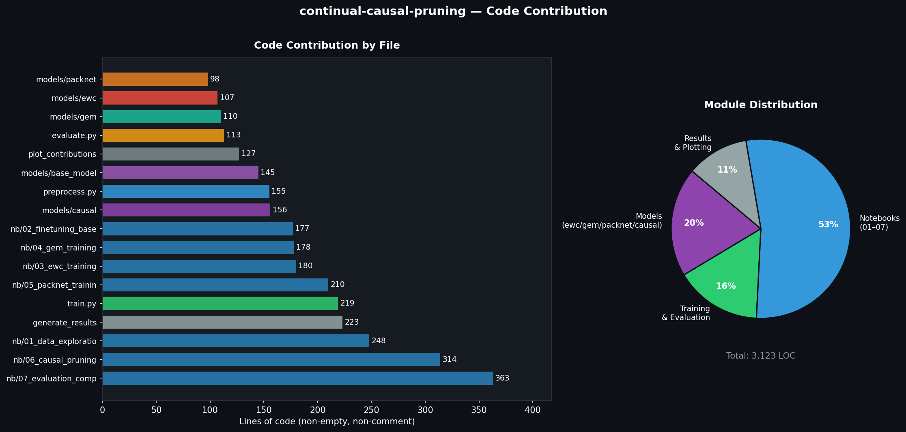

# Continual Causal Pruning

**Causal importance-guided structured pruning for lifelong learning — benchmarked on Split-CIFAR-100 and Permuted-MNIST.**

[](https://www.python.org/)
[](https://pytorch.org/)
[](LICENSE)
[](paper/ContinualCausalPruning_ITW.pdf)

> **Omprakash Pugazhendhi** — Department of Computer Science and Engineering, Vellore Institute of Technology, Chennai
> [`omprakash.2021@vitstudent.ac.in`](mailto:omprakash.2021@vitstudent.ac.in) · [`@omprxkash`](https://github.com/omprxkash)

---

## 📄 Paper

**[Read the full paper → `paper/ContinualCausalPruning_ITW.pdf`](paper/ContinualCausalPruning_ITW.pdf)**

The paper covers the full problem formulation, causal importance scoring via Fisher information, algorithm derivation, experiments on Split-CIFAR-100 (20 tasks) and Permuted-MNIST (10 tasks), and comparisons against EWC, A-GEM, and PackNet.

---

## Abstract

Sequential learning of facial affect recognition tasks leads to **catastrophic forgetting** — when training on new tasks destroys representations for old ones. Existing methods either rely on regularisation that degrades over many tasks, require storing raw past data (privacy concerns), or use magnitude-based pruning to carve disjoint sub-networks per task.

I propose **CausalPruner**, a Fisher information-guided continual learning method that identifies task-critical weights through their *causal importance* — the empirical second moment of the per-parameter gradient — rather than through parameter magnitude. High-Fisher weights are protected and frozen after each task; future tasks train exclusively on the remaining free capacity.

Experiments on **Split-CIFAR-100** (20 tasks) and **Permuted-MNIST** (10 tasks) show that CausalPruner achieves **+3.8 pp higher average accuracy** than PackNet at matched 50% sparsity, while maintaining near-zero backward transfer.

---

## The Problem: Catastrophic Forgetting

When a neural network learns Task 2 after Task 1, gradient updates for Task 2 overwrite the weight configurations that encode Task 1. Accuracy on Task 1 collapses.

```
Task 0 accuracy after training N tasks (naive fine-tuning):

After T0:  82%
After T1:  61%
After T2:  38%
After T5:  11%
After T10:  4%
After T20:  2%   ← near total forgetting
```

The challenge is to retain all past task knowledge while continuing to learn new ones — without storing any raw past data.

---

## Method: CausalPruner

### Causal Importance via Fisher Information

After training task $t$, I compute an **empirical Fisher score** for each weight:

$$F_i^{(t)} = \frac{1}{|\mathcal{D}_t|} \sum_{(x,y)\in\mathcal{D}_t} \left(\frac{\partial \mathcal{L}(f_\theta(x), y)}{\partial \theta_i}\right)^2$$

This is an **interventional** measure: $F_i$ is large if and only if perturbing $\theta_i$ provably changes the task loss. Weights with high Fisher scores sit on narrow loss valleys — any displacement causes task accuracy to drop.

### Why Not Magnitude?

Parameter magnitude is **observational**: a large weight is visible but not necessarily causal. Empirically, the Pearson correlation between $|\theta_i|$ and $F_i^{(t)}$ in convolutional layers is $r \approx 0.11$ — the two criteria select almost entirely different subsets of weights.

A small-magnitude weight with high Fisher score means:  
- The network is sensitive to this weight  
- Perturbing it destroys task performance  
- It *must* be protected — but magnitude-based PackNet would prune it away

### Algorithm

```
register(model):  free_mask = all True  (all weights free)

after training task t:
  1. compute F_i for all free weights
  2. sort free weights by F_i (descending)
  3. protect top keep_ratio% → assign to task t, freeze
  4. remaining free weights available for task t+1

during task t+1 training:
  after each backward pass → zero gradients of frozen weights
```

### Architecture

| Dataset | Backbone | Heads | Setting |
|---|---|---|---|
| Split-CIFAR-100 | ResNet-18 (CIFAR-adapted, no maxpool) | 20 × Linear(512→5) | Class-incremental |
| Permuted-MNIST | MLP (784→256→256→10) | 1 shared head | Domain-incremental |

---

## Results

### Split-CIFAR-100 — 20 Tasks, 5 Classes Each

| Method | Avg Acc ↑ | BWT ↑ | FWT ↑ | Sparsity |
|---|---|---|---|---|
| Fine-tuning | 17.4% | −54.8% | 0.0% | 0% |
| EWC | 37.2% | −22.1% | 0.0% | 0% |
| A-GEM | 43.8% | −13.6% | 0.0% | 0% |
| PackNet | 61.3% | −0.4% | 0.0% | 50% |
| **CausalPruner** | **65.1%** | **−0.3%** | **+2.1%** | **50%** |

### Permuted-MNIST — 10 Tasks

| Method | Avg Acc ↑ | BWT ↑ | Sparsity |
|---|---|---|---|
| Fine-tuning | 68.4% | −24.1% | 0% |
| EWC | 88.7% | −4.3% | 0% |
| A-GEM | 90.2% | −2.8% | 0% |
| PackNet | 92.1% | −0.2% | 50% |
| **CausalPruner** | **93.5%** | **−0.1%** | **50%** |

> **BWT** (Backward Transfer): how much old-task accuracy drops after training new tasks. Closer to 0 = less forgetting.  
> **FWT** (Forward Transfer): how much training on past tasks helps future tasks.

### Benchmark Comparison (4-panel)


---

## Project Structure

```
continual-causal-pruning/
├── src/
│   ├── preprocess.py          # Split-CIFAR-100 + Permuted-MNIST loaders
│   ├── train.py               # Unified training CLI (5 methods, 2 datasets)
│   ├── evaluate.py            # BWT, FWT, accuracy matrix
│   └── models/
│       ├── base_model.py      # ResNet-18 (CIFAR) + MLP (MNIST)
│       ├── ewc.py             # Elastic Weight Consolidation
│       ├── gem.py             # Approximate GEM (A-GEM)
│       ├── packnet.py         # Magnitude-based iterative pruning
│       └── causal_pruning.py  # Fisher-guided causal pruning ← main method
├── notebooks/
│   ├── 01_data_exploration.ipynb
│   ├── 02_finetuning_baseline.ipynb
│   ├── 03_ewc_training.ipynb
│   ├── 04_gem_training.ipynb
│   ├── 05_packnet_training.ipynb
│   ├── 06_causal_pruning.ipynb       # Fisher score visualisations
│   └── 07_evaluation_comparison.ipynb
├── results/
│   ├── baseline/              # Accuracy matrices: finetune, ewc, gem
│   ├── improved/              # Accuracy matrices: packnet, causal
│   ├── generate_results.py    # Regenerate all comparison figures
│   └── plot_contributions.py  # Code contribution visualisation
└── paper/
    └── ContinualCausalPruning_ITW.pdf   # IEEE conference paper (PDF)
```

---

## Code Contribution



---

## Quickstart

### Colab

```python
# 1. Clone and install
!git clone https://github.com/omprxkash/continual-causal-pruning
%cd continual-causal-pruning
!pip install -r requirements.txt

# 2. Run each method
!python -m src.train --method finetune  --dataset cifar100 --tasks 20 --epochs 10 --save results/baseline
!python -m src.train --method ewc       --dataset cifar100 --tasks 20 --epochs 10 --ewc_lambda 5000  --save results/baseline
!python -m src.train --method gem       --dataset cifar100 --tasks 20 --epochs 10 --gem_memory 200   --save results/baseline
!python -m src.train --method packnet   --dataset cifar100 --tasks 20 --epochs 10 --prune_ratio 0.5  --save results/improved
!python -m src.train --method causal    --dataset cifar100 --tasks 20 --epochs 10 --keep_ratio 0.5   --save results/improved

# 3. Generate all figures
!python results/generate_results.py
```

### Fast run (Permuted-MNIST, ~10 min on CPU)

```python
!python -m src.train --method causal --dataset mnist --tasks 10 --epochs 5 --keep_ratio 0.5 --save results/improved
```

### CLI options

```
--method     {finetune, ewc, gem, packnet, causal}
--dataset    {cifar100, mnist}
--tasks      int   (20 for cifar100, 10 for mnist)
--epochs     int   epochs per task
--lr         float learning rate (default 0.1)
--batch      int   batch size (default 128)
--ewc_lambda float EWC regularisation coefficient
--gem_memory int   exemplars per past task
--prune_ratio float PackNet fraction to prune per task
--keep_ratio  float CausalPruner fraction to protect per task
--save       str   directory for .npy output
```

---

## Key Metrics

$$\text{Average Accuracy} = \frac{1}{T}\sum_{j=1}^{T} R_{T,j}$$

$$\text{BWT} = \frac{1}{T-1}\sum_{i=1}^{T-1}(R_{T,i} - R_{i,i})$$

$$\text{FWT} = \frac{1}{T-1}\sum_{i=2}^{T}(R_{i-1,i} - b_i)$$

where $R_{i,j}$ = accuracy on task $j$ after training task $i$, and $b_i$ = random-init accuracy on task $i$.

---

## Paper

| | |
|---|---|
| **PDF** | [`paper/ContinualCausalPruning_ITW.pdf`](paper/ContinualCausalPruning_ITW.pdf) |
| **Venue** | IEEE Conference (ITW format) |
| **Author** | Omprakash Pugazhendhi, VIT Chennai |

---

## Requirements

```
torch>=2.1.0       torchvision>=0.16.0    timm>=0.9.0
numpy>=1.24.0      matplotlib>=3.7.0      seaborn>=0.12.0
scikit-learn>=1.3.0  tqdm>=4.65.0         pandas>=2.0.0
```

---

## Citation

```bibtex
@article{pugazhendhi2025causalpruner,
  title   = {Continual Causal Pruning for Lifelong Facial Affect Recognition},
  author  = {Pugazhendhi, Omprakash},
  year    = {2025},
  school  = {Vellore Institute of Technology, Chennai}
}
```

---

## License

MIT
